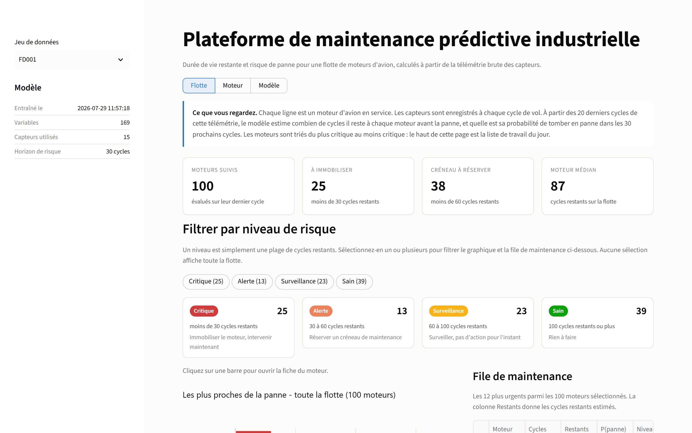
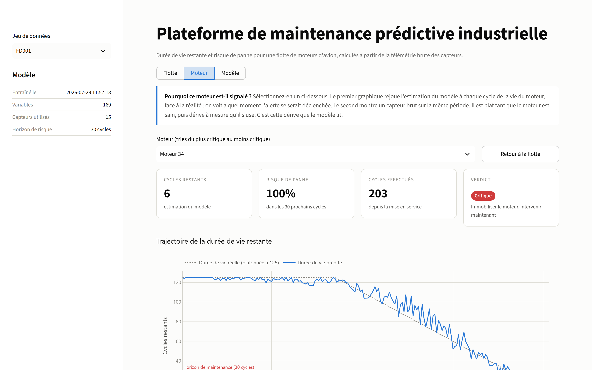
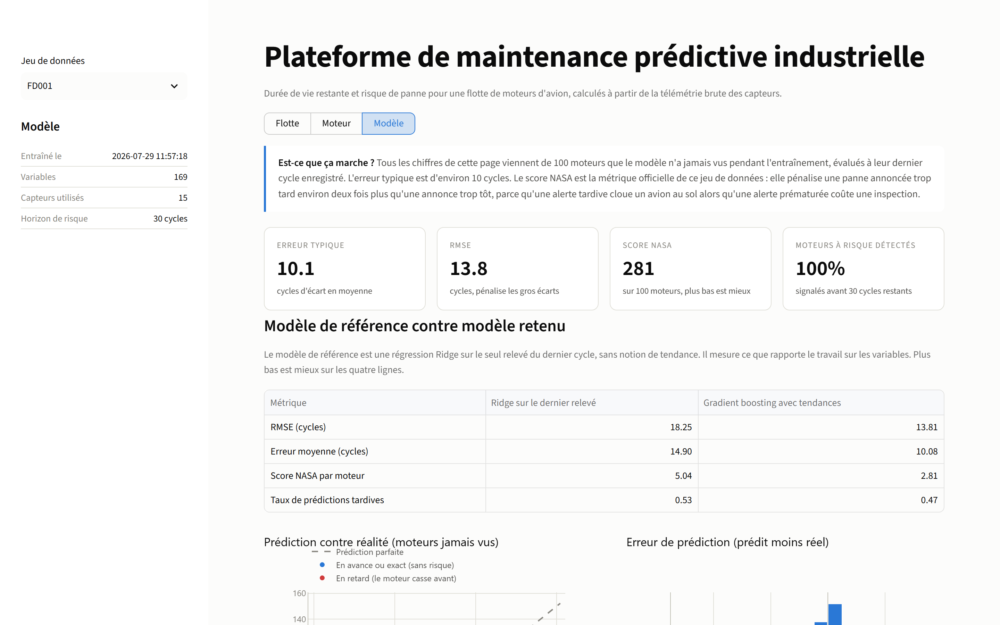
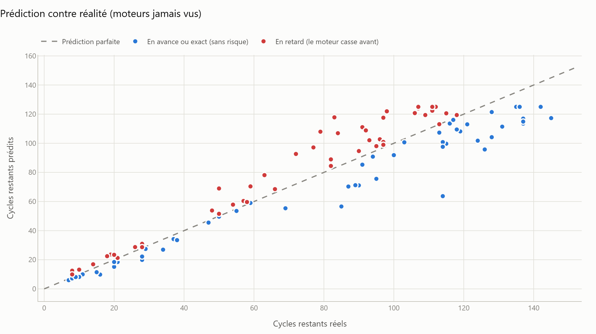
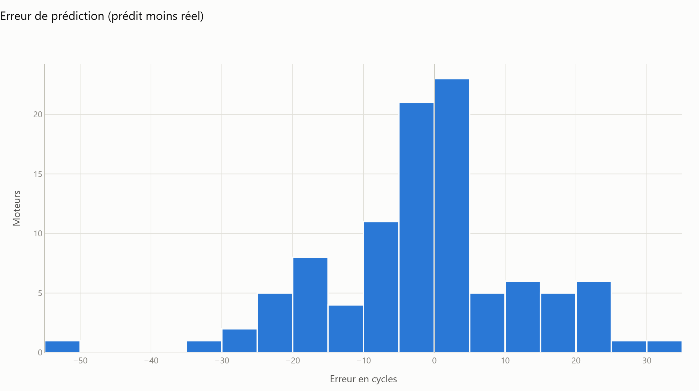
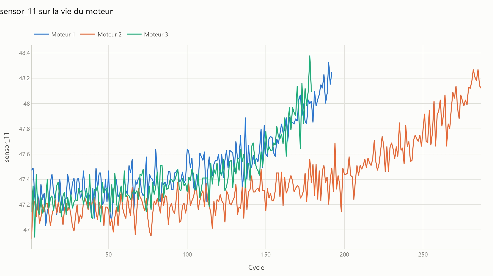
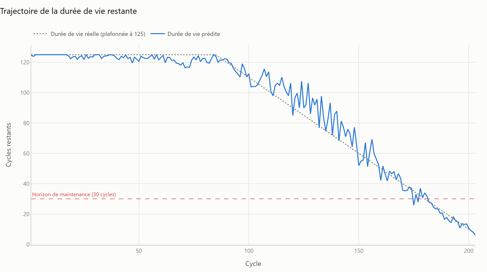

# Plateforme de maintenance prédictive industrielle

**Prédire la panne d'un moteur d'avion avant qu'elle arrive.** La télémétrie brute des
capteurs entre, la durée de vie restante et une file de maintenance triée sortent.

[](https://github.com/Sawlyer/industrial-predictive-maintenance-platform/actions/workflows/ci.yml)


Pas un notebook. Un petit produit : un pipeline de données, deux modèles, une API REST et
un tableau de bord de maintenance, reliés entre eux et testés.

**13,8 cycles de RMSE** sur 100 moteurs jamais vus, contre 18,2 pour une référence propre.



---

## Ce que ça fait

| | |
|---|---|
| **Trie la flotte** | Chaque moteur évalué à partir de sa dernière télémétrie, du plus critique au moins critique. Un planificateur ouvre le tableau de bord et sait quoi traiter aujourd'hui. |
| **Répond à "combien de temps"** | La durée de vie restante en cycles, avec la trajectoire qui y a mené. |
| **Répond à "j'interviens ?"** | Un classifieur séparé pour "tombe en panne dans les 30 cycles", parce qu'un créneau de maintenance est une décision oui/non, pas un nombre. |
| **S'explique** | Dérive des capteurs, erreur de prédiction séparée en avance/retard, comparaison avec la référence. Rien n'est une boîte noire indiscutable. |

## Lancer le projet

```bash
pip install -e ".[dev]"
make data          # telecharge le jeu de donnees NASA C-MAPSS, 12 Mo, sans compte
make train         # variables + validation croisee + entrainement, moins d'une minute
make app           # tableau de bord sur http://localhost:8501
```

Pas de réseau ? `make demo-data` génère une flotte synthétique au même format et tout le
pipeline tourne hors ligne. Elle est signalée comme synthétique partout où elle est utilisée.

API REST :

```bash
make api           # http://localhost:8000/docs
curl "localhost:8000/fleet?limit=5"
```

Docker :

```bash
docker compose up --build   # tableau de bord sur 8501, API sur 8000
```

---

## Le tableau de bord

Trois vues, calquées sur la façon dont le travail se fait vraiment.

**Flotte : quoi traiter aujourd'hui.** Les moteurs sont triés du plus critique au moins
critique. Les niveaux de risque sont cliquables et filtrent le graphique et la file de
maintenance ensemble. Cliquer sur une barre ou une ligne ouvre la fiche du moteur.

**Moteur : pourquoi celui-ci est signalé.** L'estimation du modèle est rejouée à chaque
cycle de la vie du moteur, face à la réalité, avec l'horizon de maintenance en repère. On
voit à quel moment l'alerte se serait déclenchée. En dessous, le capteur brut sur la même
période : plat tant que le moteur est sain, puis en dérive.



**Modèle : est-ce que ça marche.** Les scores sur les 100 moteurs jamais vus, la
comparaison avec le modèle de référence, et les diagnostics d'erreur.



---

## Comment ça marche

```
data/raw/*.txt                 NASA C-MAPSS FD001 : 100 moteurs jusqu'a la panne, 21 capteurs
      |
      v
predmaint.data.loader          lecture, calcul de la duree de vie restante
      |
      v
predmaint.features.build       variables causales : moyenne, ecart-type et pente glissants
      |                        sur 5, 10 et 20 cycles, plus la derive depuis le 1er cycle
      v                        21 capteurs -> 15 utiles -> 169 variables
predmaint.models.train         GroupKFold sur le moteur -> deux modeles HistGradientBoosting
      |                        regression (cycles restants) + classification (panne < 30 cycles)
      v
models/*.joblib                le modele et la liste exacte des variables qui l'a entraine
      |
      +--> app/api.py           FastAPI : POST /predict, GET /fleet
      +--> app/streamlit_app.py Tableau de bord : Flotte / Moteur / Modele
```

Trois pièces mobiles, un seul contrat partagé : la liste des variables est sauvegardée avec
le modèle, donc le service ne peut pas diverger de l'entraînement.

---

## Les quatre décisions à défendre

**1. Séparer par moteur, jamais au hasard.**
Le cycle 41 et le cycle 42 d'un même moteur sont presque la même ligne. Un découpage
aléatoire met l'un en entraînement et l'autre en validation, et annonce un score qui ne
survivra pas au premier moteur inconnu. La validation utilise `GroupKFold` sur
l'identifiant du moteur. Le test `tests/test_features.py` vérifie que tronquer l'historique
d'un moteur ne change pas ses variables antérieures. Si cette garantie casse, toutes les
métriques de ce dépôt sont fausses.

**2. Plafonner la cible d'entraînement à 125 cycles, noter contre la vérité.**
Les capteurs d'un moteur sain se ressemblent qu'il lui reste 300 ou 480 cycles. Demander au
modèle de faire la différence, c'est lui demander d'apprendre du bruit. La cible est donc
linéaire par morceaux : plate tant que le moteur est sain, décroissante une fois la
dégradation entamée. L'évaluation finale utilise en revanche les *vrais* cycles restants,
pas la version plafonnée. C'est le protocole publié pour C-MAPSS, et c'est ce qui rend les
chiffres ci-dessous comparables à la littérature.

**3. Noter avec la fonction asymétrique de la NASA, pas avec le RMSE.**
Annoncer la panne 20 cycles trop tard cloue un avion au sol. L'annoncer 20 cycles trop tôt
coûte une inspection. Le RMSE traite ces deux cas à égalité, le score officiel C-MAPSS non :

```
d = predit - reel
d <  0  (trop tard)  penalite = exp(-d / 13) - 1
d >= 0  (trop tot)   penalite = exp( d / 10) - 1
```

Le RMSE reste publié, parce que c'est ce que tout le monde compare. Le taux de prédictions
tardives aussi, parce que c'est celui qu'un responsable maintenance demande vraiment.

**4. Livrer une référence et la garder dans le dépôt.**
Une régression `Ridge` sur le seul relevé du dernier cycle, entraînée à chaque exécution et
affichée à côté du vrai modèle. C'est elle qui chiffre le travail sur les variables : si les
variables de tendance n'apportaient rien, le tableau le dirait.

---

## Résultats

NASA C-MAPSS **FD001**. Entraîné sur 100 moteurs suivis jusqu'à la panne, évalué sur 100
moteurs jamais vus, à leur dernier cycle observé : exactement la question posée en production.

| Métrique | Ridge sur le dernier relevé | Gradient boosting avec tendances | Écart |
|---|---:|---:|---:|
| RMSE (cycles) | 18,25 | **13,81** | -24 % |
| Erreur moyenne (cycles) | 14,90 | **10,08** | -32 % |
| Score NASA (100 moteurs) | 504 | **282** | -44 % |
| Taux de prédictions tardives | 53 % | **47 %** | -6 pts |

Modèle de risque, horizon 30 cycles, mêmes moteurs de test : **100 % de rappel** (25 moteurs
à risque sur 25 détectés), précision 0,93, PR-AUC 0,980, ROC-AUC 0,994.

La validation croisée en 5 blocs `GroupKFold` sur les moteurs d'entraînement va dans le même
sens : RMSE 17,05 -> 12,55, erreur moyenne 13,80 -> 8,61, score NASA par moteur 4,87 -> 2,87,
rappel 0,92 pour une précision de 0,93. Les deux protocoles bougent dans la même direction :
le gain n'est pas un découpage chanceux.

Le plus gros gain est sur le score NASA, pas sur le RMSE. Les variables de tendance corrigent
surtout les prédictions tardives, c'est-à-dire précisément l'erreur qui coûte cher.

Pour reproduire : `make data && make train && make figures`. L'entraînement prend environ
18 secondes sur un processeur portable. Il n'y a aucun GPU dans ce projet.

<table>
<tr>
<td width="50%"></td>
<td width="50%"></td>
</tr>
<tr>
<td width="50%"></td>
<td width="50%"></td>
</tr>
</table>

Les prédictions sont serrées en fin de vie, là où la décision se prend, et dispersées dans la
zone saine, où la cible est plafonnée volontairement. Les graphiques utilisent une palette
fixe adaptée au daltonisme (séparation deutan la plus faible : 9,2 en OKLab x100) et
réservent une palette de statut distincte pour le risque, pour qu'une couleur de risque ne
puisse jamais être confondue avec une série de données.

---

## Impact métier

La sortie du modèle se traduit en une seule décision : quels moteurs obtiennent un créneau de
maintenance dans la prochaine fenêtre de planification.

- **Tous les moteurs à risque ont été détectés.** À l'horizon 30 cycles, le classifieur a
  signalé 25 moteurs sur 25 réellement proches de la panne, avec une précision de 93 %, soit
  deux fausses alertes sur toute la flotte.
- **L'erreur qui coûte cher est celle qui est optimisée.** Une baisse de 44 % du score NASA
  contre 24 % de RMSE signifie que le modèle a corrigé spécifiquement les annonces tardives.
- **Exploitable, pas indicatif.** Chaque moteur porte un niveau (critique / alerte /
  surveillance / sain) et une recommandation écrite. La sortie est un ordre de travail, pas
  un nombre.

Chiffrer le gain en euros demande le coût réel d'une dépose non planifiée et celui d'une
inspection anticipée, propres à chaque exploitant. La mécanique est là, les données d'entrée
ne sont pas publiques.

---

## Organisation du dépôt

```
src/predmaint/
  config.py            chemins, schema et tous les reglages, en un seul endroit
  data/loader.py       lecture C-MAPSS et calcul de la duree de vie restante
  data/download.py     telechargement du jeu de donnees + generateur synthetique
  features/build.py    variables glissantes causales
  models/train.py      validation croisee, les deux modeles, sauvegarde
  models/evaluate.py   RMSE, erreur moyenne, score NASA, rappel / PR-AUC
  models/predict.py    FleetPredictor, le contrat d'inference unique
  viz/plots.py         le theme graphique partage
  cli.py               predmaint data | demo-data | train | report | figures
app/
  api.py               service FastAPI
  streamlit_app.py     tableau de bord Flotte / Moteur / Modele
notebooks/             exploration et modelisation, simples appels a src/
tests/                 fuite de donnees, metriques, contrat d'API, pipeline complet
```

Le code, les docstrings et les commentaires sont en anglais, convention habituelle et
lisibles par n'importe quelle équipe. L'interface et cette documentation sont en français.

`make test` lance 16 tests, dont un aller-retour complet entraînement puis prédiction.
La CI vérifie le lint et les tests sur Python 3.10 et 3.12, plus le pipeline de bout en bout.

---

## Déploiement

| Cible | Comment |
|---|---|
| Local | `make app` / `make api` |
| Conteneur | `docker compose up --build`. L'image entraîne un modèle au build, donc elle est prête à démontrer dès le premier lancement. Build et démarrage vérifiés |
| N'importe quel hébergeur de conteneurs | pas de GPU, pas de service externe, artefacts du modèle sous 5 Mo |

Sur une machine vierge, le tableau de bord ne trouve aucun modèle sur disque : il télécharge
alors le jeu de données et entraîne une fois, en une quarantaine de secondes, puis démarre
normalement. Rien de lourd n'a besoin d'être versionné.

## Suites possibles

Classées par valeur rapportée à l'heure de travail, comme cela se prioriserait en vrai :

1. **Intervalles de prédiction.** Des modèles de régression quantile pour une fourchette
   P10/P90. Un planificateur fait plus confiance à une fourchette qu'à un point.
2. **Réglage du seuil sur une matrice de coûts.** Le seuil de classification à 0,5 est un
   choix par défaut. Le bon seuil vient du rapport entre le coût d'une dépose et celui d'une
   inspection.
3. **Les sous-ensembles difficiles.** FD002 et FD004 ajoutent six régimes de fonctionnement,
   ce qui casse le filtre de variance global et demande une normalisation par régime. Les
   quatre sous-ensembles sont déjà téléchargés par `make data`.
4. **Modèles séquentiels.** Un CNN 1D ou un GRU sur la fenêtre brute, comparé à cette
   référence. À faire seulement quand le modèle tabulaire cesse de progresser.
5. **Surveillance de dérive.** Suivre la distribution des variables en production face à
   celle de l'entraînement, et alerter quand on demande au modèle quelque chose de nouveau.

## Jeu de données

NASA C-MAPSS Turbofan Engine Degradation Simulation, issu du Prognostics Data Repository de
la NASA. Public, largement utilisé comme référence, quatre sous-ensembles de difficulté
croissante. Ce projet livre FD001 (une condition de fonctionnement, un mode de panne).
`make data` le récupère directement, sans compte ni clé d'API.

A. Saxena, K. Goebel, D. Simon, N. Eklund, "Damage Propagation Modeling for Aircraft Engine
Run-to-Failure Simulation", ICPHM 2008.

## Licence

MIT. Voir [LICENSE](LICENSE).
