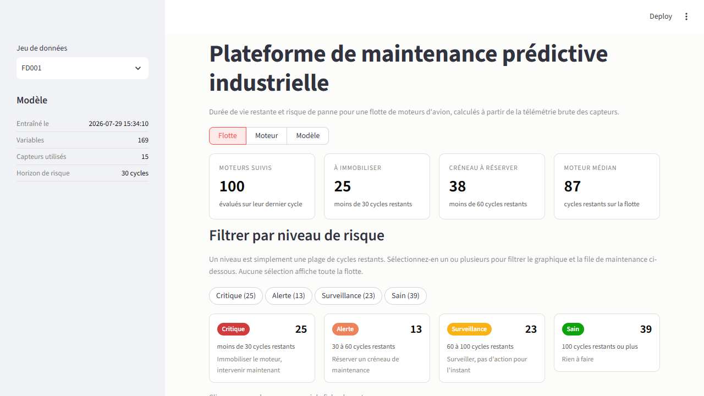
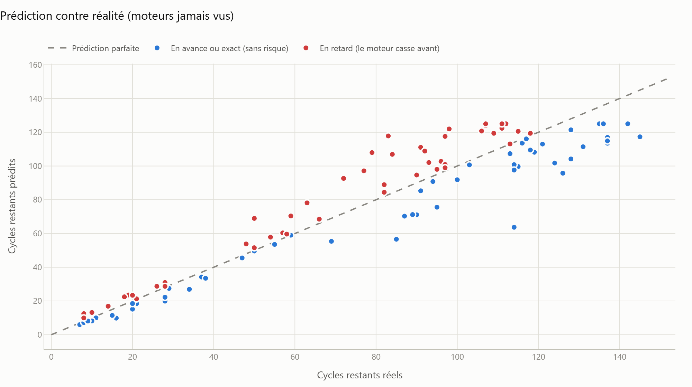
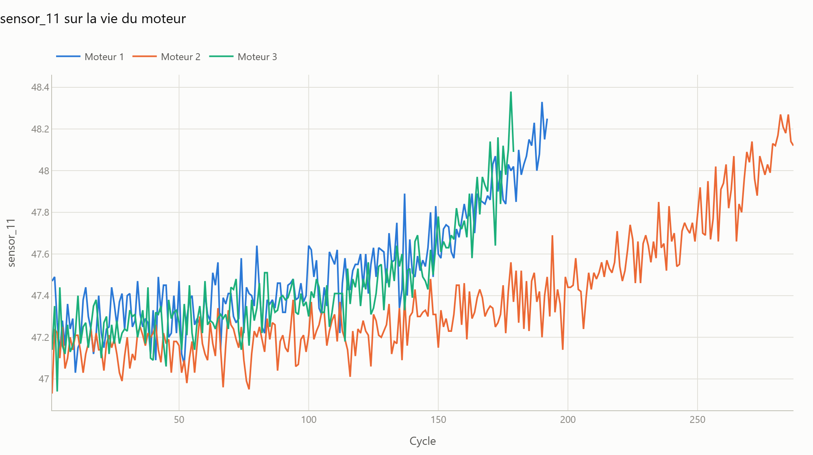

# Plateforme de maintenance prédictive industrielle

Maintenance prédictive pour moteurs d'avion : estimer la durée de vie restante, détecter les moteurs à risque et prioriser les interventions.

[](https://github.com/Sawlyer/industrial-predictive-maintenance-platform/actions/workflows/ci.yml)




## Points clés

- Pipeline complet, de la télémétrie brute aux recommandations de maintenance.
- Deux modèles : régression de durée de vie restante et classification du risque de panne à 30 cycles.
- Validation par moteur pour éviter les fuites de données entre entraînement et validation.
- API FastAPI avec les endpoints `/predict` et `/fleet`.
- Tableau de bord Streamlit avec vues flotte, moteur et modèle.
- Tests automatisés des variables, métriques, contrats API et pipeline complet.

Le modèle principal atteint **13,81 cycles de RMSE** sur 100 moteurs jamais vus, contre **18,25** pour une référence Ridge basée sur le dernier relevé.

Les chiffres ci-dessus correspondent à NASA C-MAPSS FD001. Le démarrage rapide utilise des données synthétiques pour fonctionner hors ligne ; ses métriques sont différentes et ne doivent pas être comparées aux résultats NASA.

## Lancer le projet

Prérequis : Python 3.10+.

```bash
pip install -e ".[dev]"
make demo-data
make train
make app
```

Ouvrir le tableau de bord : [http://localhost:8501](http://localhost:8501).

Le scénario de démonstration crée des données synthétiques, entraîne le modèle et écrit les artefacts dans `data/`, `models/` et `reports/`. Pour reproduire les résultats publiés sur NASA C-MAPSS, télécharger le dataset puis entraîner avec la même version Python :

```bash
make data
make train
make figures
make report
```

La CI utilise Python 3.10 et 3.12. L'entraînement complet avec validation croisée prend environ 18 secondes sur un processeur portable ; la démonstration synthétique est plus rapide. Les artefacts enregistrent la date d'entraînement, le sous-ensemble, les capteurs et les variables utilisées.

Pour utiliser NASA C-MAPSS à la place des données synthétiques :

```bash
make data
make train
make app
```

Lancer l'API séparément :

```bash
make api
```

Ouvrir la documentation API : [http://localhost:8000/docs](http://localhost:8000/docs).

Exemples API :

```bash
curl http://localhost:8000/health
curl http://localhost:8000/model
curl "http://localhost:8000/fleet?limit=5"
```

Prédiction sur un moteur :

```bash
curl -X POST http://localhost:8000/predict \
  -H "Content-Type: application/json" \
  -d '{
    "unit": 34,
    "history": [
      {"cycle": 1, "op_settings": [0.0, 0.0, 0.0], "sensors": [1.0, 1.0, 1.0, 1.0, 1.0, 1.0, 1.0, 1.0, 1.0, 1.0, 1.0, 1.0, 1.0, 1.0, 1.0, 1.0, 1.0, 1.0, 1.0, 1.0, 1.0]},
      {"cycle": 2, "op_settings": [0.0, 0.0, 0.0], "sensors": [1.0, 1.0, 1.0, 1.0, 1.0, 1.0, 1.0, 1.0, 1.0, 1.0, 1.0, 1.0, 1.0, 1.0, 1.0, 1.0, 1.0, 1.0, 1.0, 1.0, 1.0]}
    ]
  }'
```

Réponses utiles : `200` renvoie durée de vie, probabilité, niveau de risque et recommandation ; `/model` expose `model_version` basé sur la date d'entraînement ; `422` signale un payload invalide ; `503` indique qu'aucun modèle n'est chargé.

Lancer le projet avec Docker :

```bash
docker compose up --build
```

## Résultats

NASA C-MAPSS FD001. Évaluation sur 100 moteurs jamais vus, à leur dernier cycle observé.

| Métrique | Référence Ridge | Gradient boosting |
|---|---:|---:|
| RMSE | 18,25 | **13,81** |
| Erreur absolue moyenne | 14,90 | **10,08** |
| Score NASA | 504 | **282** |
| Prédictions tardives | 53 % | **47 %** |





## Architecture

```text
NASA C-MAPSS ou données synthétiques
                 |
                 v
Chargement -> variables glissantes causales -> entraînement groupé
                                             |
                                             v
                         Modèle de durée de vie + modèle de risque
                              |                         |
                              v                         v
                         API FastAPI             Tableau de bord Streamlit
```

Le modèle sauvegarde la liste exacte des variables utilisées avec l'artefact. Entraînement et inférence utilisent donc le même contrat de variables.

Voir [MODEL_CARD.md](MODEL_CARD.md) pour les données, métriques, limites et conditions d'utilisation.

## Organisation du dépôt

```text
src/predmaint/
  data/       Chargement des données et génération de données de démonstration
  features/   Variables glissantes causales
  models/     Entraînement, évaluation et prédiction
  viz/        Thème graphique partagé
  cli.py      Point d'entrée en ligne de commande
app/
  api.py              Service FastAPI
  streamlit_app.py    Tableau de bord Streamlit
tests/                Tests du pipeline, des variables, métriques et API
reports/              Métriques, graphiques et captures du tableau de bord
```

## Commandes de développement

```bash
make test       # lancer les tests
make lint       # lancer Ruff
make all        # données de démonstration, entraînement et graphiques
```

La CI exécute Ruff, les tests avec couverture sur Python 3.10 et 3.12, ainsi qu'un entraînement de bout en bout sur données synthétiques. Le détail de couverture apparaît dans les logs GitHub Actions.

## Choix techniques et limites

- `GroupKFold` par moteur évite une validation artificiellement optimiste.
- Les variables glissantes sont causales : aucune mesure future n'entre dans une prédiction passée.
- Deux modèles séparent estimation continue et décision de maintenance.
- Le score NASA pénalise davantage les prédictions tardives que les prédictions trop précoces.
- Docker fournit une démonstration locale reproductible, pas un déploiement aéronautique certifié.
- En production, ajouter authentification, limitation de débit, surveillance de dérive, calibration du seuil et validation métier.

## Licence

MIT
